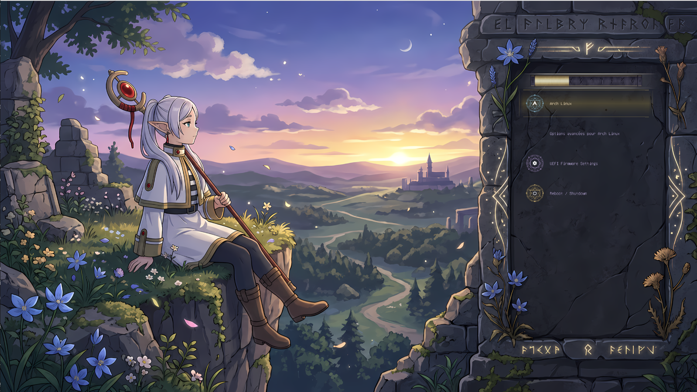

# 🌸 Frieren GRUB Theme

Thème GRUB inspiré de *Frieren: Beyond Journey's End* — ambiance mystique, minimaliste, avec une touche runique.

## 📸 Preview



---

## ⚡ Installation

```bash
sudo ./install.sh
```

Le script :
- copie le thème dans `/boot/grub/themes/`
- met à jour automatiquement la configuration GRUB

---

## 🧹 Désinstallation

```bash
sudo ./uninstall.sh
```

Le script restaure une configuration GRUB propre.

---

## 🖥️ Résolutions supportées

Le thème inclut plusieurs backgrounds :

- 1920×1080 (Full HD)
- 2560×1440 (QHD)

Le script choisit automatiquement la meilleure option selon votre écran.

---

## 🎨 Features

- Barre de progression runique animée
- Icônes custom (Linux, Windows, etc.)
- Backgrounds adaptés à plusieurs résolutions
- Style sobre et immersif

---

## 🚧 État du projet

⚠️ Le thème n’est **pas encore totalement finalisé**.

- Quelques ajustements visuels restent à faire
- Certaines configurations GRUB peuvent encore nécessiter des tweaks

---

## 🔮 À venir

Un thème **Plymouth** assorti (même univers visuel, mais design adapté au boot splash) arrivera prochainement.

